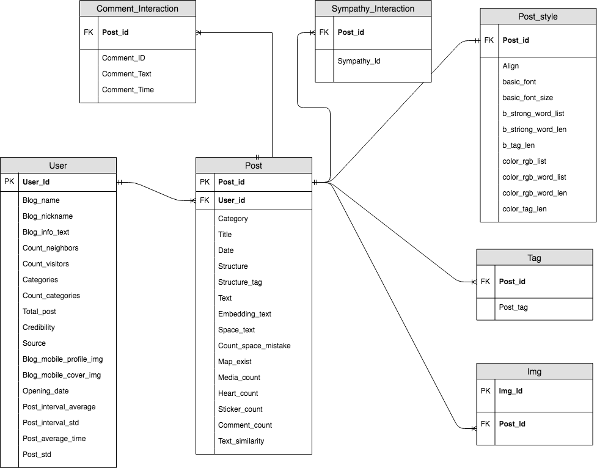

# How Do Humans Access the Credibility of Weblogs:Qualifying and Verifying Human Factors withMachine Learning

The purpose of this paper is to understand the factors in-volved when a human judges the credibility of informationand to develop a classification model for weblogs, a primarysource of information for many people. Considering bothcomputational and human-centered approaches, we con-ducted a user study designed to consider two cognitive proce-dures−(1) visceral, behavioral and (2) reflective assessmentsin the evaluation of information credibility. The results of the80study highlight that human cognitive processing variesaccording to an individual person's purpose and that humansconsider the structures and styles of content in their reflec-tive assessments. We experimentally proved these findingsthrough the development and analysis of classification mod-els using 16,304 real blog posts written by 2,944 bloggers. Ourmodels yield greater accuracy (88.2%) and efficiency (fewerdimensions) than the models with well-known best featuresidentified in prior research.

## Researcher
*	Researcher    
    *	조용걸 [아주대학교 데이터사이언스학과 / yonggeol93@ajou.ac.kr]
*	Research Assistant 
    * 김민우 [아주대학교 미디어학과 / rlaalsdn4242@ajou.ac.kr] 
*	Adviser 
    *	한경식 [아주대학교 데이터사이언스학과 / kyungsikhan@ajou.ac.kr]

## Research Questions

*	RQ: What is a reader's cognitive processing of information credibility in blogs and how does the understanding of such processing influence a computational analysis of information credibility in blogs?

## Data Set
*	Naver
*	Dbdbdeep

## 참고 논문

*	1\. Michael A Banks. 2008.Blogging heroes: interviews with 30 of theworld’s top bloggers. John Wiley & Sons.
*	2\. Mikhail Bautin, Lohit Vijayarenu, and Steven Skiena. 2008. Interna-tional Sentiment Analysis for News and Blogs.. InICWSM.
*	3\. Fabricio Benevenuto, Gabriel Magno, Tiago Rodrigues, and VirgilioAlmeida. 2010. Detecting spammers on twitter. InCollaboration, elec-tronic messaging, anti-abuse and spam conference (CEAS), Vol. 6. 12.
*	4\. Judee K Burgoon and Jerold L Hale. 1984. The fundamental topoi ofrelational communication.Communication Monographs51, 3 (1984),193–214.
*	5\. Carlos Castillo, Marcelo Mendoza, and Barbara Poblete. 2011. Infor-mation credibility on twitter. InProceedings of the 20th internationalconference on World wide web. ACM, 675–684.
*	6\. Dietrich Dörner and Harald Schaub. 1994.  Errors in planning anddecision-making and the nature of human information processing.Applied psychology43, 4 (1994), 433–453.
*	7\. Jonathan St BT Evans. 2008. Dual-processing accounts of reasoning,judgment, and social cognition.Annu. Rev. Psychol.59 (2008), 255–278.
*	8\. heories of higher cognition: Advancing the debate.Perspectives onpsychological science8, 3 (2013), 223–241.
*	9\. Emilio  Ferrara,  Onur  Varol,  Clayton  Davis,  Filippo  Menczer,  andAlessandro Flammini. 2016. The rise of social bots.Commun. ACM59,7 (2016), 96–104.
*	10\. Andrew J Flanagin and Miriam J Metzger. 2003. The perceived credi-bility of personal Web page information as influenced by the sex ofthe source.Computers in human behavior19, 6 (2003), 683–701.
*	11\. BJ Fogg and Hsiang Tseng. 1999. The elements of computer credibility.InProceedings of the SIGCHI conference on Human Factors in ComputingSystems. ACM, 80–87.
*	12\. Brian J Fogg. 2003. Prominence-interpretation theory: Explaining howpeople assess credibility online. InCHI’03 extended abstracts on humanfactors in computing systems. ACM, 722–723.
*	13\. Brian J Fogg, Cathy Soohoo, David R Danielson, Leslie Marable, Ju-lianne Stanford, and Ellen R Tauber. 2003.  How do users evaluatethe credibility of Web sites?: a study with over 2,500 participants. InProceedings of the 2003 conference on Designing for user experiences.ACM, 1–15.
*	14\. Namrata Godbole, Manja Srinivasaiah, and Steven Skiena. 2007. Large-Scale Sentiment Analysis for News and Blogs.Icwsm7, 21 (2007),219–222.
*	15\. Kyungsik Han. 2018. How do you perceive this author? Understandingand modeling authorsâĂŹ communication quality in social media.PloSone13, 2 (2018), e0192061.
*	16\. Daniel Kahneman and Shane Frederick. 2002.   Representativenessrevisited: Attribute substitution in intuitive judgment.Heuristics andbiases: The psychology of intuitive judgment49 (2002), 81.
*	17\. Andreas M Kaplan and Michael Haenlein. 2010.  Users of the world,unite! The challenges and opportunities of Social Media.Businesshorizons53, 1 (2010), 59–68.
*	18\. Hyoungkoo Khang, Eyun-Jung Ki, and Lan Ye. 2012. Social media re-search in advertising, communication, marketing, and public relations,1997–2010.Journalism & Mass Communication Quarterly89, 2 (2012),279–298.
*	19\. KP Krishna Kumar and G Geethakumari. 2014. Detecting misinforma-tion in online social networks using cognitive psychology.Human-centric Computing and Information Sciences4, 1 (2014), 14.
*	20\. Kyumin Lee, James Caverlee, and Steve Webb. 2010. Uncovering socialspammers: social honeypots+ machine learning. InProceedings of the33rd international ACM SIGIR conference on Research and developmentin information retrieval. ACM, 435–442.
*	21\. Stephan Lewandowsky, Ullrich KH Ecker, Colleen M Seifert, NorbertSchwarz, and John Cook. 2012.  Misinformation and its correction:Continued influence and successful debiasing.Psychological Science inthe Public Interest13, 3 (2012), 106–131.
*	22\. Fangtao Li, Minlie Huang, Yi Yang, and Xiaoyan Zhu. 2011.  Learn-ing to identify review spam. InIJCAI Proceedings-International JointConference on Artificial Intelligence, Vol. 22. 2488.
*	23\. Yuqing Lu, Lei Zhang, Yudong Xiao, and Yangguang Li. 2013. Simul-taneously detecting fake reviews and review spammers using factorgraph model. InProceedings of the 5th annual ACM web science confer-ence. ACM, 225–233.
*	24\. Universal McCann. 2008. Universal McCann social media tracker wave3, March 2008.Universal McCann, New York(2008).
*	25\. Meredith Ringel Morris, Scott Counts, Asta Roseway, Aaron Hoff, andJulia Schwarz. 2012. Tweeting is believing?: understanding microblogcredibility perceptions. InProceedings of the ACM 2012 conference oncomputer supported cooperative work. ACM, 441–450.
*	26\. Arjun Mukherjee, Vivek Venkataraman, Bing Liu, and Natalie S Glance.2013. What yelp fake review filter might be doing?. InICWSM. 409–418.
*	27\. Don Norman. 2013.The design of everyday things: Revised and expandededition. Constellation.
*	28\. Myle Ott, Yejin Choi, Claire Cardie, and Jeffrey T Hancock. 2011. Find-ing deceptive opinion spam by any stretch of the imagination. InProceedings of the 49th Annual Meeting of the Association for Computa-tional Linguistics: Human Language Technologies-Volume 1. Associationfor Computational Linguistics, 309–319.
*	29\. Rebecca B Rubin and Michael P McHugh. 1987.   Development ofparasocial interaction relationships. (1987).
*	30\. Richard Samuels. 2006. The magical number two, plus or minus: Somecomments on dual-process theories. InProceedings of the 28 th AnnualConference of the Cognitive Science Society, Vol. 202. 207.
*	31\. Herbert Simon. 1957.  Abehavioral model of rational choice.Modelsof man, social and rational: Mathematical essays on rational humanbehavior in a social setting(1957).
*	32\. Hyeonjin Soh. 2013.   Attributes of trusted blog contents: throughanalysis of product-reviews in powerblogs and consumer survey.TheJournal of the Korea Contents Association13, 1 (2013), 73–82.
*	33\. Gianluca Stringhini, Christopher Kruegel, and Giovanni Vigna. 2010.Detecting spammers on social networks. InProceedings of the 26thannual computer security applications conference. ACM, 1–9.
*	34\. eter M Visscher, Jian Yang, and Michael E Goddard. 2010. A commen-tary on âĂŸcommon SNPs explain a large proportion of the heritabilityfor human heightâĂŹby Yang et al.(2010).Twin Research and HumanGenetics13, 6 (2010), 517–524.
*	35\. Yingxu Wang and Vincent Chiew. 2010. On the cognitive process ofhuman problem solving.Cognitive systems research11, 1 (2010), 81–92.
*	36\. Debbie Weil. 2006.The corporate blogging book. Piatkus.
*	37\. Sung-Un Yang and Joon Soo Lim. 2009. The effects of blog-mediatedpublic relations (BMPR) on relational trust.Journal of Public RelationsResearch21, 3 (2009), 341–359.
*	38\. Yiming Yang and Jan O Pedersen. 1997. A comparative study on featureselection in text categorization. InIcml, Vol. 97. 412–420.

